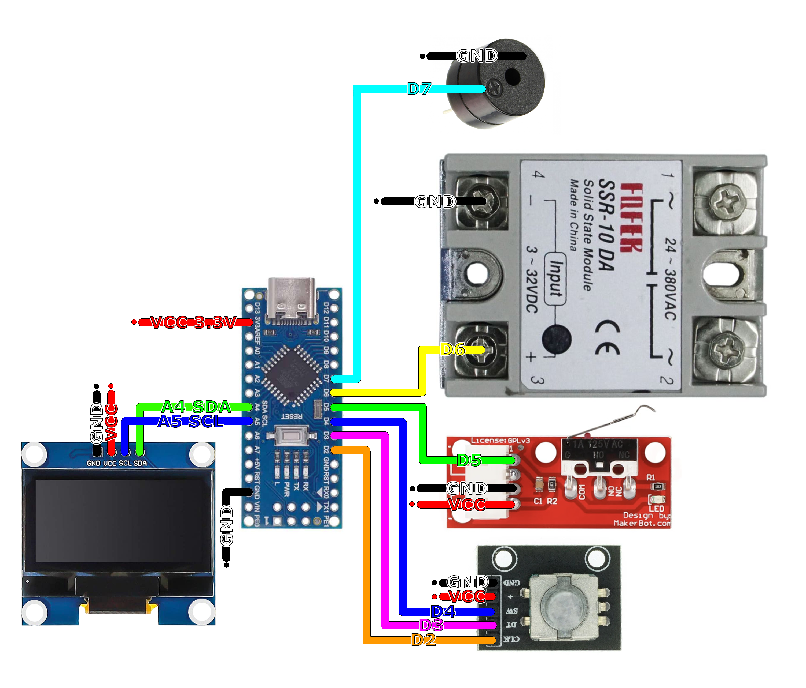
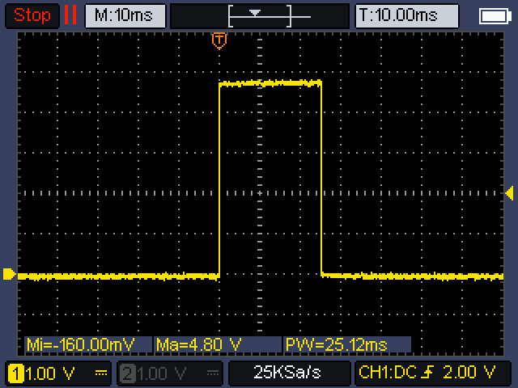
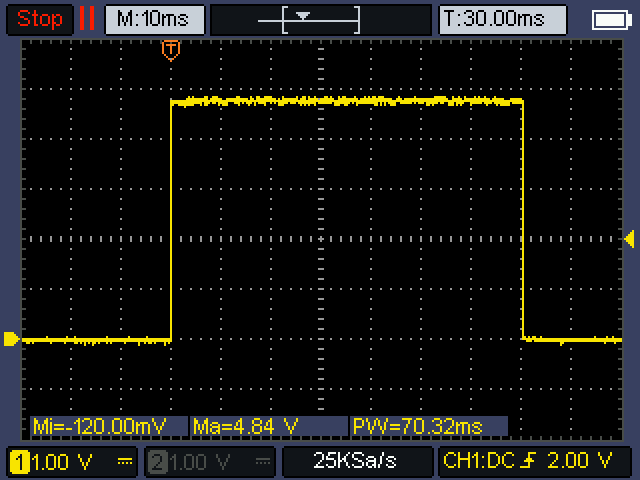
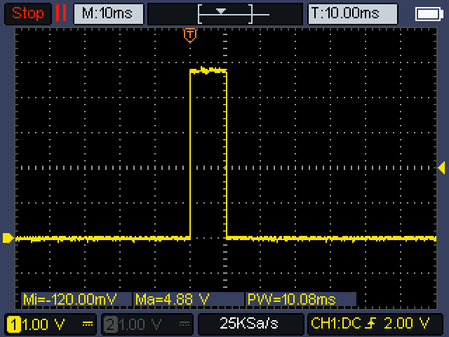

# Introdução
Código para Arduino Nano (Atmega328p) para controlar o pulso da solda ponto caseira, inspirado no [projeto do Marlon Nardi](https://marlonnardi.com/2023/12/03/como-fazer-solda-ponto-profissional-para-baterias-18650-e-mais-construa-sua-propria-bicicleta-eletrica-1/). Apesar do princípio ser o mesmo, o código é radicalmente diferente. A versão mínima não usa o alto-falante e o botão no eixo do encoder.

Importante: não foi testado utilizando microinterruptor sem debounce, ou seja, apenas o switch ligado diretamente no pino de controle com pullup do hardware da microcontroladora. No futuro, eu pretendo fazer esse teste e observar o comportamento no osciloscópio para depois reportar na descução do projeto se o funcionamento ocorre da forma esperada.

A documentação é parcial e pode ser entendida de forma completa primeiro estudando o [projeto original](https://marlonnardi.com/2023/12/03/como-fazer-solda-ponto-profissional-para-baterias-18650-e-mais-construa-sua-propria-bicicleta-eletrica-1/) no qual foi baseado.

# Material necessário
1. Arduno Nano (Atmega328p)
2. Display OLED 1.3" I2C 12864 (SH1106G)
3. Fim de curso mecânico RAMPS 1.4
4. Relé de estádo sólido (SSR) Fotek 40A
5. Encoder / Decoder rotativo KY-040
6. Alto-falante / buzzer piezo 12mm 3.3v (opcional)

# Ligação

# Exemplos 
Imagens da captura do osciloscópio, pulsos configurados em 25, 70 e 10 millisegundos, respectivamente:

